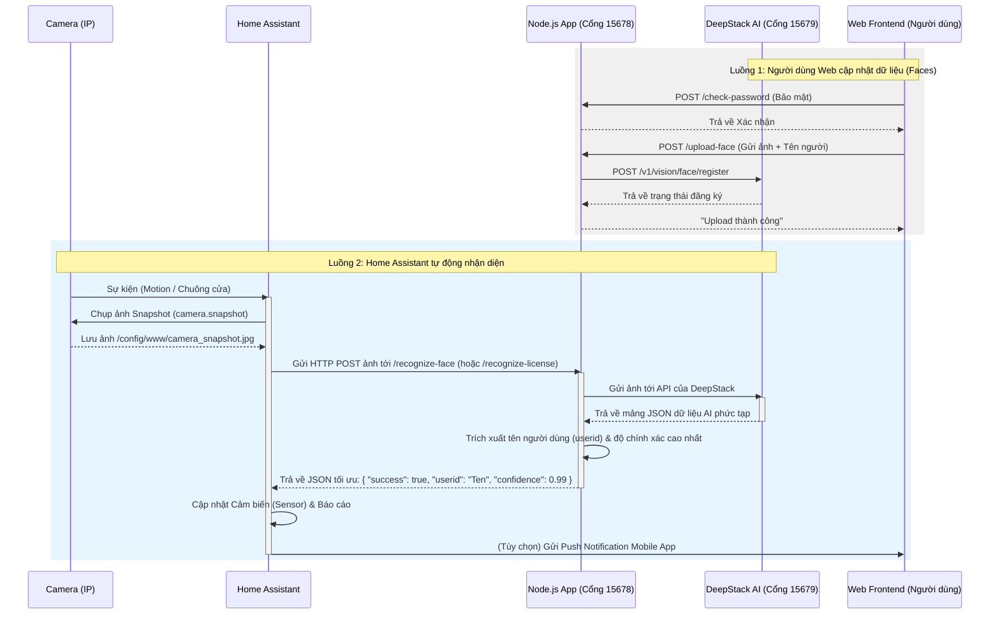

# Hướng Dẫn Toàn Diện: DeepStack AI & Home Assistant

Tài liệu này tổng hợp toàn bộ cách thức hoạt động, các chức năng, danh sách câu lệnh cần thiết và luồng xử lý (workflow) của ứng dụng DeepStack AI WebApp khi tích hợp với Home Assistant.

---

## 1. Sơ Đồ Cách Thức Hoạt Động (Workflow)



---

## 2. Danh Sách Chức Năng Của Ứng Dụng

Ứng dụng Node.js đóng vai trò là "cầu nối" (middleware) giúp đơn giản hóa giao tiếp giữa DeepStack và các hệ thống khác:

1.  **Nhận diện khuôn mặt (Face Recognition)**
    *   API Endpoint: `/recognize-face`
    *   Công dụng: Nhận diện xem người trong ảnh đã được đăng ký trước đó hay chưa.
    *   Cổng truy cập: 15678
2.  **Đăng ký khuôn mặt mới (Face Registration)**
    *   API Endpoint: `/upload-face`
    *   Công dụng: Lưu trữ đặc điểm nhận dạng của một người, gán với một ID (Tên). (Cần nhập Password).
3.  **Nhận diện Biển số xe (License Plate Recognition)**
    *   API Endpoint: `/recognize-license`
    *   Công dụng: Đọc và xuất chuỗi văn bản của biển số.
4.  **Nhận diện Chữ viết tay / Văn bản (OCR)**
    *   API Endpoint: `/recognize-ocr`
    *   Công dụng: Đọc tất cả các chữ cái có trong ảnh.

---

## 3. Tổng Hợp Các Lệnh Thao Tác (Command Cheatsheet)

### A. Quản lý source code
Cập nhật mã nguồn mới nhất từ Github nếu có thay đổi:
```bash
cd /opt/deepstack-app # Hoặc thư mục chứa source bạn đã clone
git pull
```

### B. Quản lý Docker & Container
Build lại ứng dụng Node sau khi bạn đã sửa mã nguồn:
```bash
docker-compose build nodeapp
```

Khởi động tất cả các dịch vụ (DeepStack & Node API):
```bash
docker-compose up -d
```

Dừng toàn bộ hệ thống đang chạy:
```bash
docker-compose down
```

Kiểm tra log theo thời gian thực (Giúp xem lỗi khi HA gọi sang):
```bash
# Xem log ứng dụng Node
docker logs -f node-webapp

# Xem log thực tế bên trong lõi DeepStack AI
docker logs -f deepstack-ai
```

---

## 4. Tương Tác Bằng Lệnh Gọi API (CURL)

Bạn có thể test trực tiếp bằng terminal / SSH trước khi đưa vào Home Assistant:

**Test Nhận diện khuôn mặt:**
```bash
curl -X POST -F "image=@/duong/dan/toi/anh_thu_nghiem.jpg" http://localhost:15678/recognize-face
# Kết quả mong đợi: {"success":true,"userid":"Huy","confidence":0.99}
```

**Test Đăng ký khuôn mặt mới (Bỏ qua giao diện Web):**
```bash
curl -X POST -F "image=@/duong/dan/toi/anh.jpg" -F "userid=HuyQuang" http://localhost:15678/upload-face
```

---

## 5. Cấu Hình Home Assistant Đầy Đủ (YAML)

### Cảm Biến Nhận Diện
Trong `configuration.yaml`:

```yaml
command_line:
  # Cảm biến Nhận diện khuôn mặt
  - sensor:
      name: AI Face
      unique_id: face_recognition_result
      command: "curl -s -X POST -F 'image=@/config/www/snapshot.jpg' http://<IP_MAY_CHAY_NODE>:15678/recognize-face"
      scan_interval: 86400 # Cập nhật thủ công
      value_template: "{{ value_json.userid | default('unknown') }}"
      json_attributes:
        - confidence

  # Cảm biến Nhận diện biển số
  - sensor:
      name: AI License Plate
      unique_id: license_plate_recognition_result
      command: "curl -s -X POST -F 'image=@/config/www/snapshot.jpg' http://<IP_MAY_CHAY_NODE>:15678/recognize-license"
      scan_interval: 86400
      value_template: "{{ value_json.license_plate | default('unknown') }}"
```

### Script Gọi Camera
Trong `scripts.yaml`:

```yaml
chup_anh_va_quet:
  alias: "Quét AI Camera Cổng"
  sequence:
    - service: camera.snapshot
      target:
        entity_id: camera.cong_chinh
      data:
        filename: /config/www/snapshot.jpg
    - delay: 00:00:01 # Đợi file lưu xong
    - service: homeassistant.update_entity
      target:
        entity_id: sensor.ai_face
```

### Automation Cảnh Báo
Trong `automations.yaml`:

```yaml
- alias: "Báo động người lạ hoặc người quen"
  trigger:
    - platform: state
      entity_id: binary_sensor.chuyen_dong_cong
      to: "on"
  action:
    # Kêu gọi lấy ảnh
    - service: script.chup_anh_va_quet
    
    # Chờ Node.js & Deepstack xử lý (thường khoảng 2-4 giây)
    - delay: 
        seconds: 3
    
    # Gửi thông báo có kèm ảnh
    - service: notify.notify
      data:
        title: "Cảnh báo Camera Cổng"
        message: >
          
            Người lạ xuất hiện ở cổng!
          
            Chào {{ states('sensor.ai_face') }} đã về nhà (Độ chính xác: {{ state_attr('sensor.ai_face', 'confidence') * 100 }}%)
          
        data:
          image: "/local/snapshot.jpg"
```
